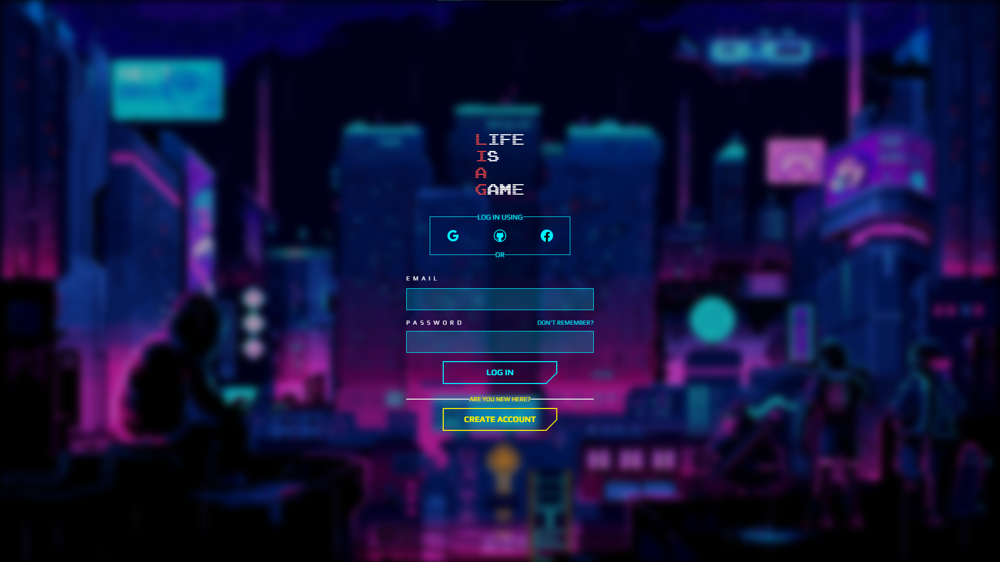
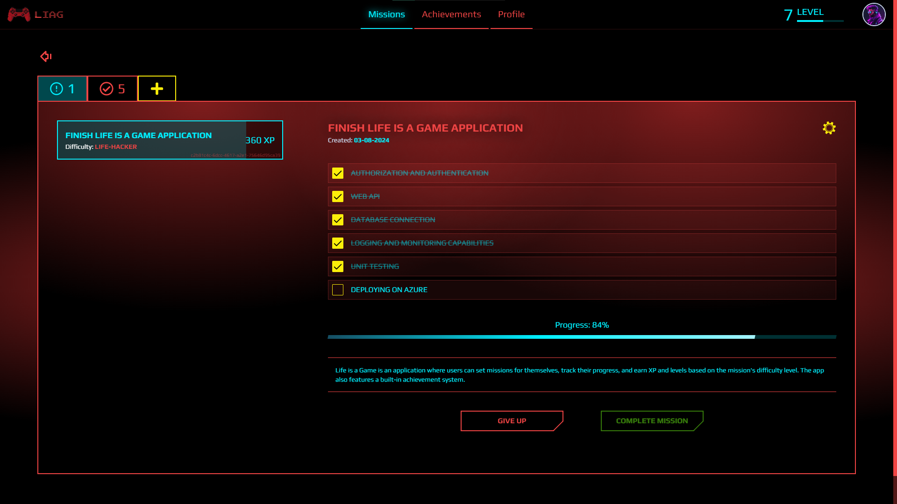
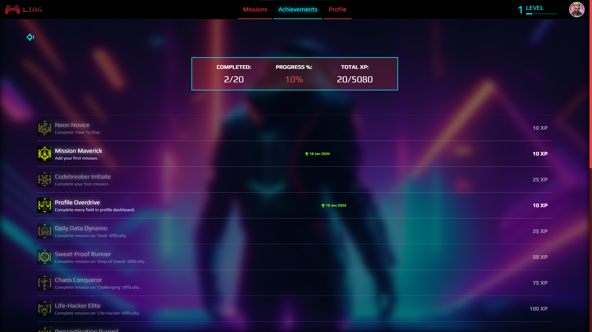
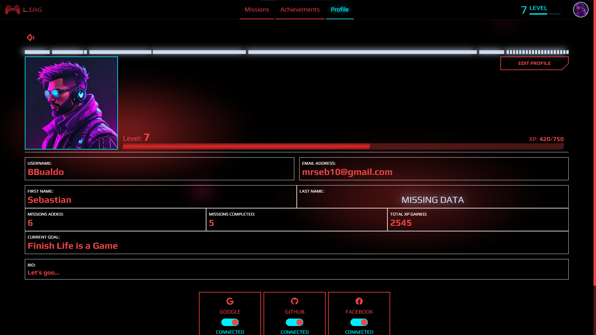
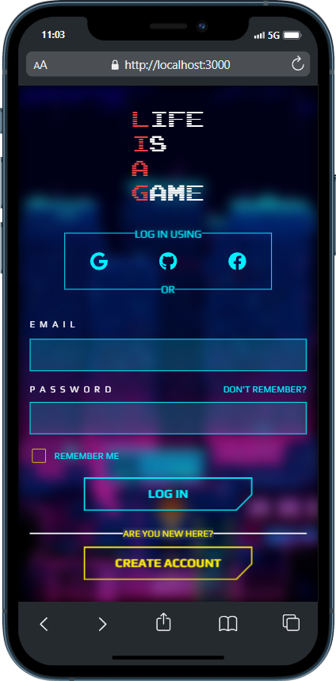
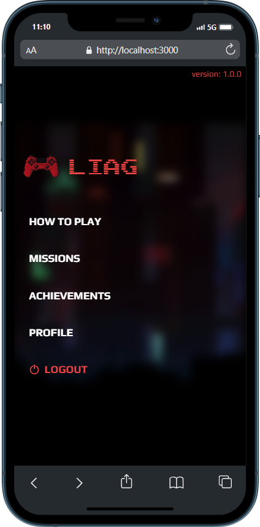
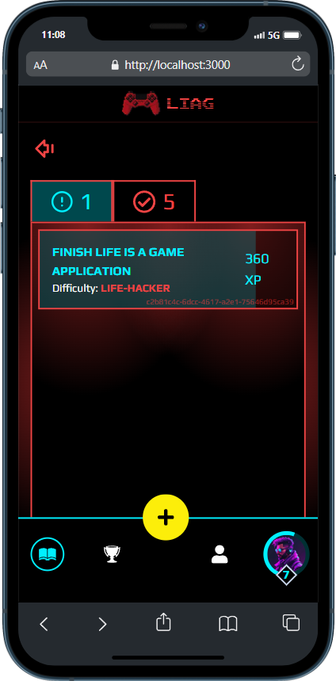
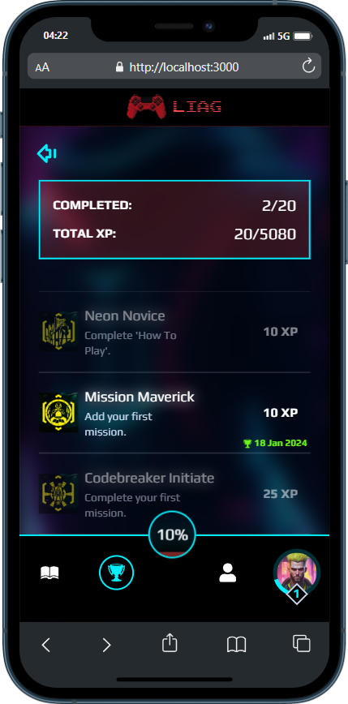
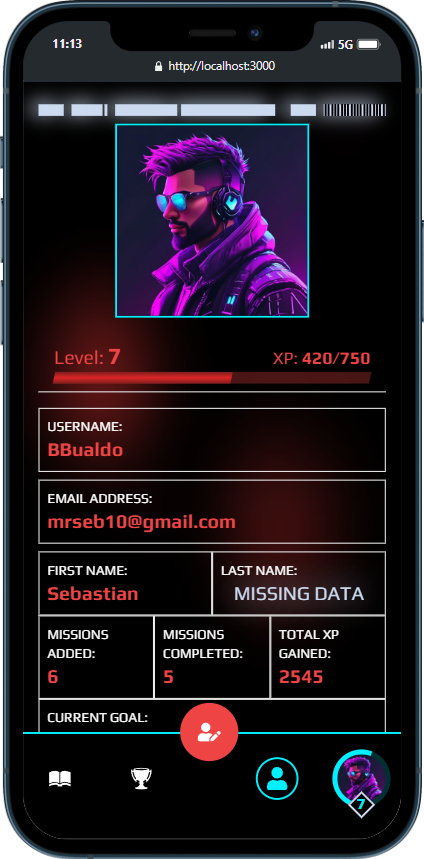

# Life is a Game

Life is a Game is an application where users can set missions for themselves, track their progress, and earn XP and levels based on the mission's difficulty level. The app also features a built-in achievement system.

## Table of contents

- [Overview](#overview)
    - [Screenshots](#-screenshots)
    - [Features](#-features)
- [My process](#my-process)
    - [Backend implementation](#backend-implementation)
        - [Authorization and Authentication](#authorization-and-authentication)
        - [CRUD Operations](#crud-operations)
        - [External Auth](#external-auth)
        - [Logging and Unit Testing](#logging-and-unit-testing)
        - [Code cleanup](#code-cleanup)
    - [Built with](#-built-with)
    - [What I have learned](#what-i-have-learned)
    - [Areas to improve](#areas-to-improve)
    - [Useful resources](#useful-resources)
- [Author](#author)

## Overview

### 📸 Screenshots

#### Desktop






#### Mobile






### 🧐 Features

- Interactive tutorial to introduce the app's main concepts
- CRUD operations for managing missions
- Advanced difficulty level system with contextual hints
- XP and level progression
- Achievements to unlock
- User profile customization (Username, Avatar, Bio, etc.)
- Authentication and authorization
- Integration with external providers for authentication (Facebook, Google, GitHub)

## My process

### Frontend implementation

#### To be filled in the future, as the original content was lost in December 2023. :(

### Backend implementation

1. Defined Models with Data Annotations and created ```DbContext``` using **Entity Framework Core** with **ASP.NET Identity**.
2. Ensured that Achievements are created on Database creation.

#### Authorization and Authentication
3. Created DTOs for login, register and reset password purpose.
4. Configured **ASP.NET Identity**.
5. ```AuthService``` implementation to store responsibility for actions like login, logout, registering and password recovery. For now, I only implemented methods responsible for login, register and logout. Wondered what these methods should return, so I created ```AuthOperationResult``` class which purpose is to store results of auth operations.
6. Implemented ```AuthController``` with basic authorization endpoints.
7. Created endpoint to get current logged-in user info (```UserDto```).
8. Refactored login and sign-up **Zod schemas** (like including regex validators in password), created ```UserService``` React class and added methods for login and register, which for now are just sending POST request via **Axios** without error and loading handling or routing. Successful response adds token in Cookies. I also had to provide CORS policy.
9. Now the most difficulty part has begun - refactoring half of an existing Next.js/Redux codebase to handle authentication and authorization and make space for existing real database data and for not implemented yet. I started with auth, because it's the hardest and most important thing. I deleted all Redux files except store and created ```authSlice``` to keep currently logged-in user data, which forced me to consider refactoring ```useUser``` hook and every component which uses user data. Furthermore, I have to handle routing unauthorized users to login page and authorized from login page if they try to reach it directly via URL.
10. Handled routes protection using Next.js ```middleware```.
11. Added fetching current user data to form submit logic and configured **Redux-Persist** to keep user data upon refreshing page without need to make extra requests.
12. Added toasts (snackbars) upon successful registering and errors as well. I have also taken care of loading state until request is performed to prevent user from taking any actions like spamming login button, etc.
13. Introduced **RememberMe** checkbox in login form.

#### CRUD Operations
14. Updated User to store external providers IDs and deleted **is_unlocked** row from **UserAchievements** table, because record presence is already a sign that achievement is unlocked.
15. Created ```AchievementsRepository```, ```AchievementsService``` and ```AchievementsController``` to get all achievements as well as those unlocked by user, and to unlock specific achievement.
16. Refactored frontend for handling achievements from database. When user logs in and goes into **Achievements** page, React ```useAchievements``` custom hook is calling ```AchievementsService``` for fetching fresh **Achievements** and **UserAchievements** data, saves them in **Redux** state, which is also saved in localStorage. I have mapped **UserAchievements** to JS Map for faster unlocked achievements searching. Then achievements are compared to user achievements to determine, which are unlocked and when.
17. Created Repository => Service => Controller for **Missions** management. First, I set up assigning missionId Foreign Key in Subtasks manually in Dto object, but then I have made some research about **EF Core Navigation Properties**, so I have added ```public Mission Mission { get; set; }``` into my Subtask Model class. Now it sets missionId automatically. However, I have problem when trying to update Mission with subtasks, probably because lack of subtask management layer, so that's what I was going to do.
18. Assigned empty list to ```List<Subtask>``` in Mission model to avoid nullable checks.
19. When updating mission, I had to insert login to manually determine which subtask exists in mission already, which one is new and which one is missing, so it can be removed. I decided to make subtask ID mandatory for creating new one to simplify the process. I'm going to use **uuid** in React to achieve this.
20. Created TypeScript ```IMission``` and ```ISubtask``` models as well as DTOs for adding and updating missions purposes, and also ```MissionsService``` class with necessary methods and finally ```useMisssions``` hook to centralize missions data. Then I implemented Redux ```missionsSlice``` and ```selectedMissionSlice``` again. After reworking some variables, filtering and other code parts to fit fresh approach, I've successfully managed displaying missions with all details and selecting missions to work.
21. Refactored ```CreateMissionForm``` and Zod Schema to fit current data expected and returned from API. Adding missions works.
22. Meanwhile, I found out that despite token being present in cookies it can be expired which prevents user from performing authorized operation. Have to keep this in mind and introduce refreshing tokens.
23. Refactored ```EditMissionForm``` and created separate Zod Schema to fit current data expected and returned from API. Updating missions works.
24. Refactored deleting missions.
25. Refactored toggling subtasks' completion.
26. Refactored completing mission.
27. Uncommented mini-modal invoked by click on the avatar in navbar, which lets user log out from any page. However, I had to introduce ```isLoggedOut``` property in Redux ```authSlice``` state, because logging out sets various state as null and in custom hooks I'm checking if specific state is null to decide if request should be made. Without that property, when user was logging out, ```useUser``` hook performed request for getting current user data.

#### NOTE: Every operation sends requests to API and updates the data in Database, however to prevent redundant data fetching after each update I'm using Redux-Persist to update UI. After user logout Redux is clearing all information, so after logging in fresh data is fetched and saved in Redux again.

28. ```ILevelsService``` implementation with method responsible for updating user's xp and level accordingly.
29. Created ```UserController``` with ```AddXp``` endpoint and tested it with **Swagger**.
30. Introduced React ```UserService``` and invoked it's ```addXp``` method into ```completeMission``` function. I also refactored returned data from ```AddXp``` endpoint from entire user object to ```xp```, ```level``` and ```totalXpGained```, which are updated in Redux user state.
31. Taken care of incrementing **Missions Added** and **Missions Completed** stats.
32. Implemented logic for unlocking achievements. ```AchievementsService``` gets user's and achievement's ID and unlocks it for that user. In React, I centralized logic for finding and unlocking achievements if they are not already achieved by using ```useAchievementUnlocker``` custom hook. API endpoint returns ```AchievementUnlockDto``` with ```UserAchievement``` ID, ```Achievement``` title and requirements and updated XP and Level to update values in Redux and affect UI accordingly. For now, I only tested it on 'Complete Tutorial' achievement.
33. I extended ```Achievement``` table with **Key** property to identify achievements safer. Now, ```findAndUnlock``` method in ```useAchievementUnlocker``` hook accepts that key instead of hard coded id which can be changed over time (like migrating from development to production).
34. I have renamed ```findAndUnlock``` method to ```tryUnlockAchievement```, because it's more verbose. Naming is the most difficult part of programming, they say. I also separated achievements for completing missions to ```checkMissionAchievements```, just not to bomb ```missionComplete``` function with a lot of code.
35. Achievements for leveling up has been moved into ```checkLevelAchievements``` function, called in Main Menu, but it should be called in more common place or in multiple places to ensure that user gets the achievement wherever he is. I will come back to that later, because I have to implement profile editing for one of achievements.
36. Created ```IProfileService``` to handle profile edit. In React same procedure - DTO model, ```UserService``` extended with ```updateProfile``` method, accepting **firstName**, **lastName**, **currentGoal** and **bio**, and also Redux reducer function that updates user info locally.
37. At this moment, I realised that ```authSlice``` is actually not a good naming, because in fact, it mainly operates on user object, so I changed it to ```userSlice```.
38. Handled profile updating in React as well as errors by introducing ```OperationResult``` object returned from that endpoint. I also have to return it from ```AuthService``` operations to make error handling easier.
39. Handled avatar updating by updating ```ProfileService```, ```UserController``` and Redux ```userSlice```. Avatar local path is sent to API and updated in DB as AvatarURL. In future user will be able to upload his own profile images.
40. Added remaining achievements checks and centralized achievement unlock check in ```useAchievementUnlocked``` by passing functions into ```useEffect```. Then I invoked that hook in every common component to make sure user unlocks achievement as soon as he meets requirements.
41. Added profile UI for managing linked external providers. It checks if user has Google ID, Facebook ID or Github ID to determine if switch should be checked or not. I also modified ```UserDto``` to include those IDs.

#### External Auth
42. Starting with Github, I set up Application on the platform, which gave me ClientID and ClientSecret. I implemented ```loginWithGithub``` method in ```AuthService```, which simply redirects user to ```https://github.com/login/oauth/authorize``` with specified query parameters. After successful log-in, user is redirected to ```/github-callback``` page. I also created that callback pages for Facebook and Google in advance.
43. In callback page I check for ```code``` in query parameters. If there is no code included, user is redirected to the ```/login``` page. Otherwise, application sends that code to ```/auth/login-with-github``` endpoint. In the following ```AuthController``` method I create new client with ```IHttpClientFactory``` and pass it with received code to service method. ```IAuthService``` is responsible for exchanging code for token and ```IGithubService``` for getting user data and emails (Github requires separate request for user emails if it's not public). Then I check if user with specified email already exists. If true, I check assign ```GithubId``` to his account and log-in, else I create new user and do the same.
44. Added ability to unlink account from Github and fixed problem with linking logging in with that account again. I had to create separate if statement when user is already in Database and after checking his Github ID - log him in.
45. Refactored ```AuthService``` ```LoginWithGithubAsync``` method to ```LoginOrLinkWithGithubAsync``` which now additionally accepts userId as optional parameter. If userId is provided, that means user is logged in already and only wants to link his account with Github. Otherwise, it means user is not logged in and want to perform logging in with Github and optionally linking if not linked already. That was a challenge actually, had to take paper and pen and draw that schema to see, which code can be reused to follow ```DRY``` principle. I also had to modify ```github-callback``` page to check if user is already logged in to perform linking action, and also I had to check if Github account which user wants to link his profile with is already assigned to one.
46. Moving to the Facebook, I created my application on ```Meta for Developers``` platform. Remaining steps were almost the same, but it forced me to all External Auth Services have ```ExchangeCodeForTokenAsync``` method, because there was too many significant differences to handle in reusable method. I also had to assign email as username for new user, because Facebook doesn't have username.
47. Moving to Google, I've made the same steps - created app on ```GCP```, handling frontend requests and responses, creating additional controller endpoint, service and handling user logging in and linking/unlinking account with Google.
48. A problem occured when trying to create account based on email from external provider. I forgot to invoke ```UserManager.CreateAsync()``` method. Now it's fixed and good to go.
49. Added ability to update Username with other profile details.
#### Logging and Unit Testing
50. Added ```Logging``` service and added it to log potential errors and log it into ```ErrorLogs``` database table. I have to keep this in mind while formatting responses in future to log every potential error.
51. Created **xUnit** project for testing and used **FakeItEasy** package to for Mocking purposes.
52. Tested ```ILevelsService```.
53. Tested ```IMissionsService``` and ```ISubtasksService``` partially by the way.

#### Code cleanup
54. Moved each ```{provider}-callback``` code into one reusable ```useExternalAuthCallback``` hook with ```providerName``` parameter.
55. Cleaned up not used code and imports.
56. Created Zod Union type to combine add and edit mission form schema - ```combinedMissionFormSchema```.
57. Fixed bug when mission was selected and user was logged out, after logging to any account, that previously selected mission was still showing as selected.
58. Added Error icon to Toaster globally and removed individual setups. Had to wrap it with ```ts-ignore``` though, because TypeScript finds it as error.
59. Handled all errors and replaced all pascalCase endpoints to kebab-case.

#### Azure Email Service for Password Recovery
60. I have created ```IEmailService``` interface with ```SendEmailAsync``` method and use it in both ```RequestPasswordResetAsync``` and ```ResetPasswordAsync``` methods. First method will take email, find user by that email and send generated token via email. Second one will use those information to reset user's password to new one which he will provide when clicking the received email.
61. Configured **Azure Communication Service** with generated subdomain and passed ConnectionString to user-secrets.
62. Created ```AzureEmailService``` and configured token provider to get password reset token. Everything is working.
63. Implemented UI to let user enter email in case of password reset and provided appropriate method in ```AuthService```.
64. Did the same for password reset, React component checks if there is an email and reset token, and lets user enter his new password. It's then sent to API endpoint and the password is changed.

#### Further Development
65. In ```useAchievementsUnlocker``` split useEffect to 3 UseEffects, one for each achievement category check. I need to think about dependencies in the array because up to now it caused those achievements unlock twice (probably because React doesn't catch up with Redux state updates).
66. In ```EditProfileForm``` I used ```useWatch``` from **React-Hook-Form** ```useMemo``` to track if user changed any values in his profile info. If not, there is no need to perform any requests.
67. Defined ```EnsureCreated``` EF method to be sure that Database is successfully created when application is started.

### 🧰 Built with

- Next.js
- .NET
- TailwindCSS
- RadixUI/Shadcn-UI
- Framer-Motion
- Redux Toolkit
- Redux-Persist
- Axios
- React Hook Form
- Zod
- TypeScript
- C#
- ASP.NET Identity
- Entity Framework Core
- SQL Server
- xUnit
- FakeItEasy
- Azure


### What I have learned

- Difference between ```AddIdentity```, ```AddIdentityCore``` and ```AddDefaultIdentity```.
- Reminded about using ```Map``` and ```Array.reduce()``` function to sum things up without having to create temporary variable.
- Meaning of **Entity Framework Core** Navigation Properties and that EF is not so good at updating nested objects.
- Setting up Next.js ```middleware``` to run additional logic between requests.
- Tokens doesn't disappear from cookies just like in Swagger, they just expire and that has to be handled. (TODO)
- Using ```Set``` to store unique values and manage them easily.
- Using **xUnit** ```Theory``` with ```InlineData```.
- Mocking services and repositories using **FakeItEasy** .NET library.
- Displaying code Unit Test coverage using **dotCover**.
- Configuring **Azure Communication Service** and using it to send email to user.
- Using React ```useMemo``` hook
- Configuring ```Azure``` Web Services and SQL Database
- Publishing API to ```Azure```

### Areas to improve
- I have to deepen knowledge about cookies handling, especially on the way Client => API => Next.js middleware, because when I successfully hosted API on Azure and Next.js app on Vercel, I couldn't get token in middleware. Locally it works, but in production it's just invisible, despite being present in set-cookie and cookies as well. This makes app not redirecting to Main Menu after successful authentication, because it's cookie based.

### Useful resources

I built this app working with documentations:

- [Next.js](https://nextjs.org)
- [Redux Toolkit](https://redux-toolkit.js.org)
- [TailwindCSS](https://tailwindcss.com)
- [Identity with Single Page Applications](https://learn.microsoft.com/en-us/aspnet/core/security/authentication/identity-api-authorization?view=aspnetcore-8.0)
- [Zod](https://zod.dev)
- [Shadcn-UI](https://ui.shadcn.com)
- [Axios](https://axios-http.com/docs/intro)
- [FakeItEasy](https://fakeiteasy.github.io/docs/8.3.0/)
- [Framer-Motion](https://www.framer.com/motion/)
- [Redux-Persist](https://www.npmjs.com/package/redux-persist)

And video tutorials:
- [Redux - Complete Tutorial (with Redux Toolkit)](https://www.youtube.com/watch?v=5yEG6GhoJBs&t=1907s)
- [Unit Testing in C# 2022: 4. Mocking EXPLAINED SIMPLY [FakeItEasy]](https://www.youtube.com/watch?v=GMYCNfDXQIk)
- [ASP.NET Core Logging Crash Course](https://www.youtube.com/watch?v=XrCxy0SNRqM&t=1s)
- [Next.js 14 Tutorial - 44 - Middleware](https://www.youtube.com/watch?v=xrvul-JrKFI&t=441s)
- [Send an email with Azure Communication Services](https://www.youtube.com/watch?v=t0in_d9Q2mU&t=588s)
- [Learn React Hooks: useMemo - Simply Explained!](https://www.youtube.com/watch?v=vpE9I_eqHdM)

**ChatGPT** also helped me when I was stuck (but I don't believe it can steal our jobs honestly 😆)

#### 🎇 And of course the great **The C# Academy** platform and community, where I'm member since 04 April 2024 and which helped me learn a lot of things that made this application become Fullstack. 🎇

## Author

- Website - [BBualdo](https://www.sebastianopozda.com)
- LinkedIn - [Sebastian Opozda](https://www.linkedin.com/in/sebastian-opozda/)
- Github - [BBualdo](https://github.com/BBualdo)