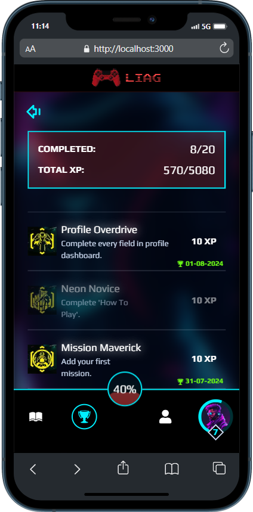

# Life is a Game

This is an application where users can set missions for themselves, track their progress and earn XP and levels based on the mission's difficulty level. The app also features a built-in achievement system.

## Table of contents

- [Overview](#overview)
    - [Screenshots](#-screenshots)
    - [Features](#-features)
- [My process](#my-process)
    - [Built with](#-built-with)
    - [What I have learned](#what-i-have-learned)
    - [Useful resources](#useful-resources)
- [Author](#author)
- [Acknowledgments](#acknowledgments)

## Overview

### 📸 Screenshots

#### Desktop

#### Mobile

### 🧐 Features

- Slider-like tutorial showing main concepts of an app
- Creating, tracking, updating and deleting missions
- Gaining XP and leveling up
- Earning achievements
- Editing profile information (Avatar, Bio, Current Goal, etc.)
- Authentication and Authorization (soon)
- External Providers Auth (Facebook, Google, GitHub) (soon)

## My process
Coming soon...

### 🧰 Built with

### What I have learned

Coming soon...

### Useful resources
Coming soon...

## Author
Coming soon...

## Acknowledgments
Coming soon...